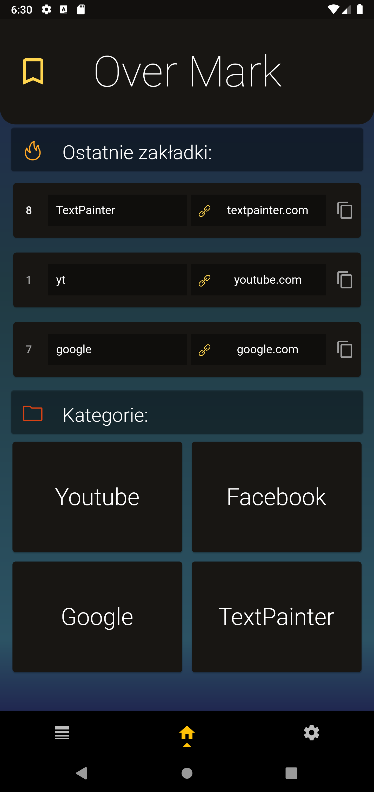
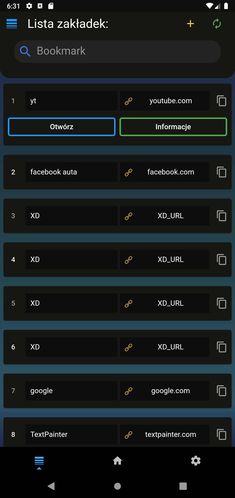
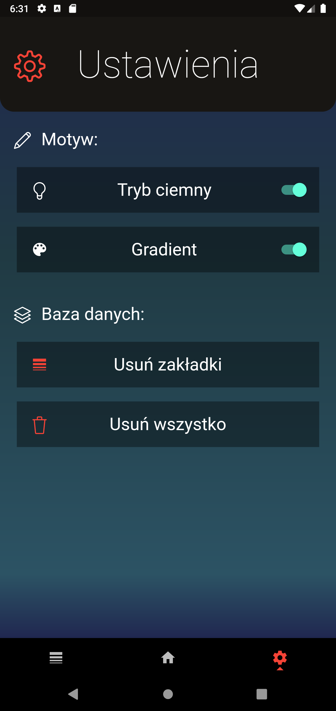

# OverMark
## Overview
Aplikacja na system Android służąca do przechowywania linków. 

## Description 
Celem aplikacji jest przechowywanie zakładek zawierających linki użytkownika (adresy url).  
Zakładki dodajemy za pomocą formularza otwieranego z ekranu listy zakładek.  
  
Aplikacja posiada 3 ekrany:  
*  Ekran główny - zawierający ostatnio edytowane zakładki oraz listę kategorii,

*  Ekran listy zakładek - zawierający listę zakładek,  

*  Ekran ustawień - zawierający podstawowe ustawienia aplikacji,  

## Tools
* Dart 2.9.0
* Flutter 1.20.1
* sqflite 1.3.1
*  theme_provider: 0.3.3
*  path_provider: 1.5.1
*   flutter_icons: 1.1.0
*   webview_flutter: 0.3.22+1

## How to run
* Android
* install overmark.apk

## Future improvements
* Dodanie usuwania pojedyńczych linków
* Dodanie edycji linków

## Author
**Michał Popiel** - [ReQezeR](https://github.com/ReQezeR)

## License
[MIT](https://choosealicense.com/licenses/mit/)
